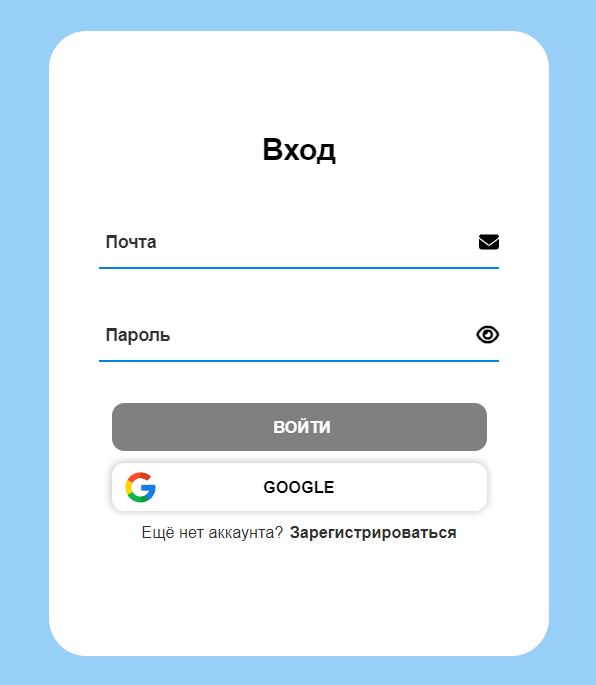
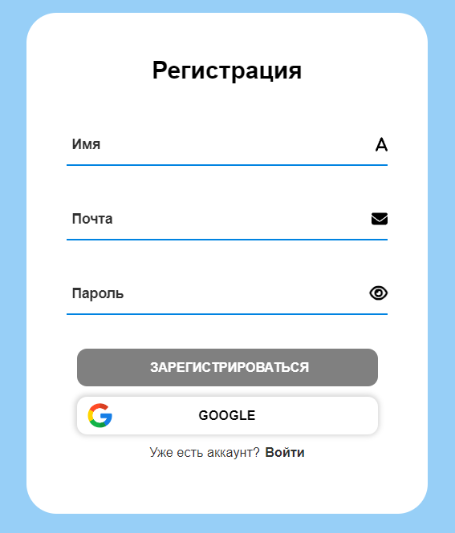
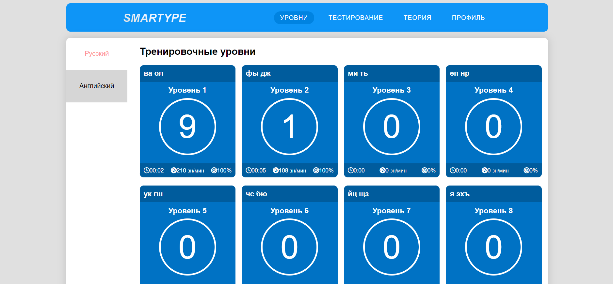
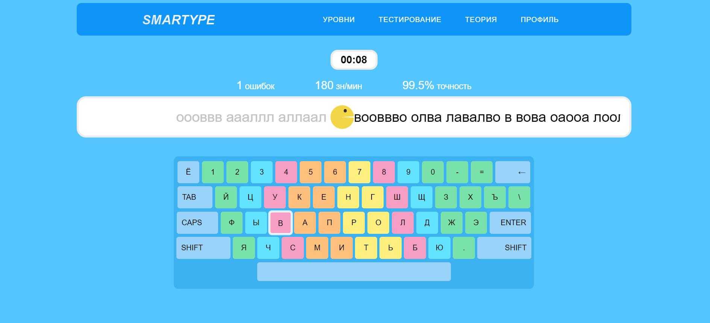
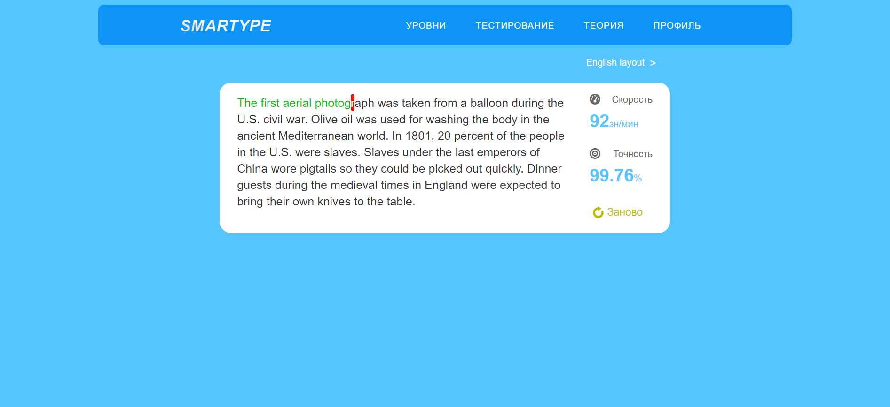
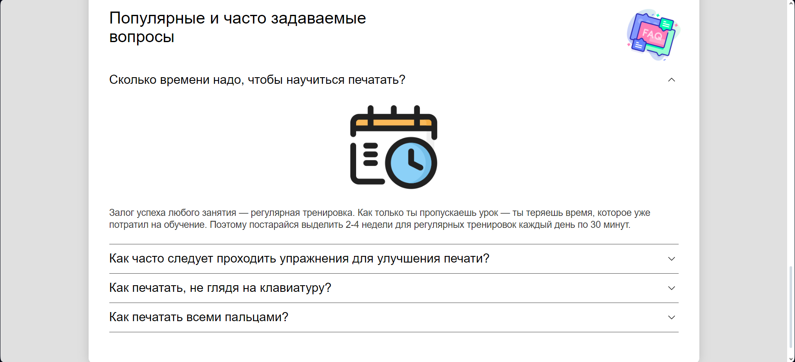
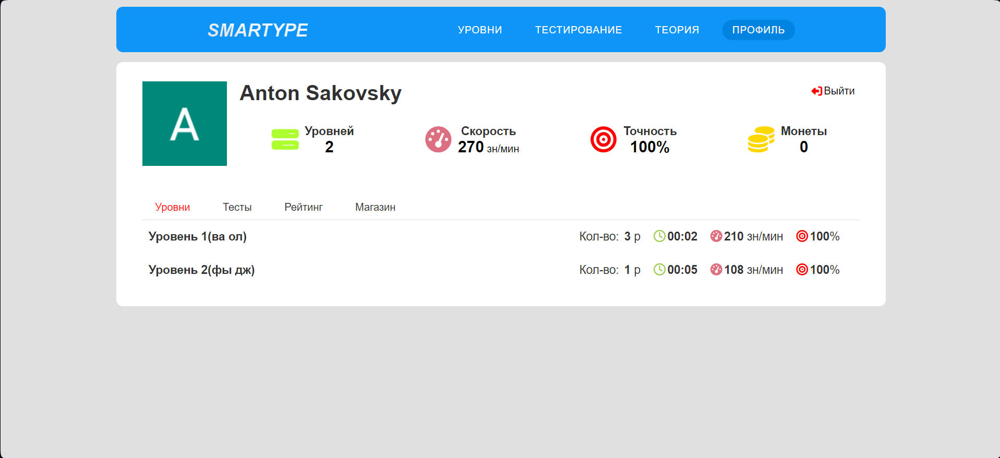
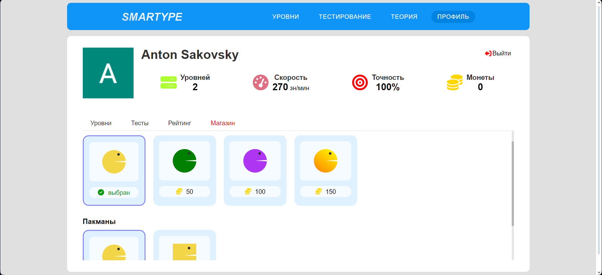

# Keybord trainer Smartype

## Description

This is a great typing trainer that will help you increase your typing speed and improve your touch typing skills.

In a game format you can complete levels and receive rewards, and then buy cool things in the store.

If you are confident enough, you can take the test and show your typing skills to the world.

## Screenshots

<h3 style='margin: 5px 0px' >Login form</h3>

<h3 style='margin: 5px 0px' >Registration form</h3>

<h3 style='margin: 5px 0px' >Levels</h3>

<h3 style='margin: 5px 0px' >Level page</h3>

<h3 style='margin: 5px 0px' >Testing page</h3>

<h3 style='margin: 5px 0px' >Smooth accordion</h3>

<h3 style='margin: 5px 0px' >Profile page</h3>

<h3 style='margin: 5px 0px' >Store</h3>

## Built With

## Contacts

 
